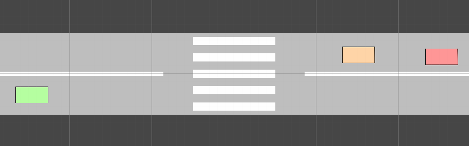

# Установка
1. Усановить Unity 6.3.11
2. Открыть проект и открыть сцену SampleScene из assets/scenes (внизу)
3. Запустить проект
4. Управлять машиной можно с помощью кнопок WASD4.
5. Если открыть консоль (вкладка внизу рядом с Project) то при запуске увидим сообщения о столкновении в логе

# Autonomous Driving Critical Scenario Simulator

Research simulation platform for testing decision-making algorithms of autonomous vehicles in critical traffic situations.

## Goal

The goal of this project is to create a simulation environment where autonomous driving algorithms can be tested in dangerous road scenarios without real-world risks.

The platform focuses on algorithmic behavior rather than graphical realism.

## Architecture

The system consists of two main parts:

### Simulation (Unity)

Responsible for:

- road environment
- vehicle motion
- collision detection
- scenario generation
- simulation logging

### Analysis (Python)

Responsible for:

- analysis of simulation logs
- comparison of agent strategies
- visualization of metrics

## Technologies

Simulation:

- Unity
- C#

Analysis:

- Python
- NumPy
- Pandas
- Matplotlib / Plotly

## Project Goals

- create a custom traffic simulation environment
- implement basic traffic behaviour
- detect critical situations
- implement autonomous decision-making agent
- compare strategies through simulation experiments

## Project Status

Early prototype.

Current stage:

- base simulator development
